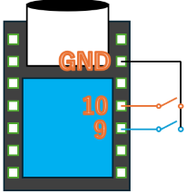

# Arduinoでモールス信号キーボードを作成する

このプロジェクトでは、Arduinoボードを使用してモールス信号を入力し、それを文字に変換してパソコンにキーボード入力として送信する方法を説明します。エンターキーやバックスペースキーなどの特殊文字もサポートしています。

WebSite: http://sanae.starfree.jp  
Author: SanaeProject

## ハードウェア要件

- Arduinoボード（例：Arduino Uno）
- プッシュボタン×2
- ブレッドボードとジャンパワイヤー

## ソフトウェア要件

- Arduino IDE
- Keyboardライブラリ

## 配線

- 長音短音ボタン  
プッシュボタンをArduinoの`InputBTN`(10番:初期)に接続しグランドに接続してください。

- 長音ボタン  
プッシュボタンをArduinoの`InputLongBTN`(9番:初期)に接続しグランドに接続してください。  

ボタンの色を分けることを推奨します。  

## インストール手順

1. **リポジトリのクローン**: リポジトリをクローンまたはダウンロードして、ローカルマシンに保存します。

2. **スケッチを開く**: Arduino IDEで`.ino`ファイルを開きます。

3. **Keyboardライブラリのインストール**: `Keyboard`ライブラリがインストールされていない場合は、Arduino IDEのライブラリマネージャーからインストールします。

4. **コードをアップロード**: Arduinoをコンピュータに接続し、コードをアップロードします。

## 使用方法

プッシュボタンを押してモールス信号を入力します。
- 短押し（ドット）: 1
- 長押し（ダッシュ）: 2

文字の入力が完了したら、`Timeout`ms待つと、文字の終わりが検出されます。

モールス信号が文字に変換され、接続されたコンピュータにキーボード入力として送信されます。エンターキーやバックスペースキーなどの特殊文字もサポートしています。

## モールス信号
### 数字
- `0: -----`
- `1: ----.`
- `2: ---..`
- `3: --...`
- `4: -....`
- `5: .....`
- `6: ....-`
- `7: ...--`
- `8: ..---`
- `9: .----`

### アルファベット a-z
- `a: .-`
- `b: -...`
- `c: -.-.`
- `d: -..`
- `e: .`
- `f: ..-.`
- `g: --.`
- `h: ....`
- `i: ..`
- `j: .---`
- `k: -.-`
- `l: .-..`
- `m: --`
- `n: -.`
- `o: ---`
- `p: .--.`
- `q: --.-`
- `r: .-.`
- `s: ...`
- `t: -`
- `u: ..-`
- `v: ...-`
- `w: .--`
- `x: -..-`
- `y: -.--`
- `z: --..`

### 特殊記号
- `.: .-.-.-`
- `, : --..--`
- `:: ---...`
- `?: ..--..`
- `': .----.`
- `-: -....-`
- `(: -.--.`
- `): -.--.-`
- `/ : -..-.`
- `= : -...-`
- `+: .-.-.`
- `": .-..-.`
- `×: -..-`
- `@: .--.-`

### 特殊キー
- `\n: .-.-`
- `\b: ----`
